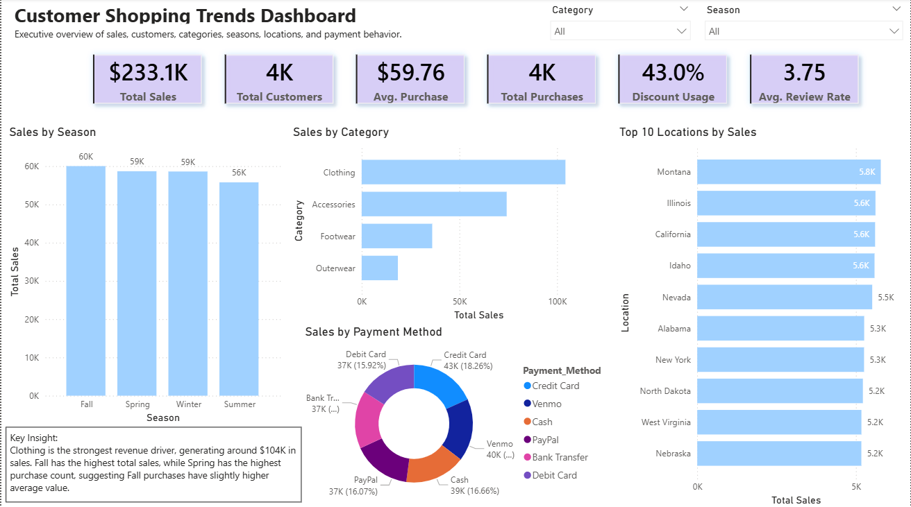

# Customer Shopping Trends Dashboard | Power BI

## Project Overview

This project analyzes customer shopping behavior using a retail shopping dataset of 3,900 customer records. The goal was to build an interactive Power BI dashboard that helps understand sales performance, customer behavior, product preferences, subscription behavior, loyalty groups, and discount impact.

The dashboard is designed as a business intelligence case study for retail, e-commerce, and marketing analytics roles.

## Business Questions

- Which product categories generate the most sales?
- Which customer groups have the highest average purchase amount?
- How do subscription status and loyalty groups relate to purchasing behavior?
- Do discounted purchases show higher average purchase value?
- Which seasons and locations generate stronger sales performance?

## Tools Used

- Power BI
- DAX
- Python
- pandas
- Data cleaning
- Data visualization
- Business intelligence
- Customer analytics
- Marketing analytics

## Dataset

The dataset used is the Customer Shopping Latest Trends dataset from Kaggle.

Dataset source: https://www.kaggle.com/datasets/bhadramohit/customer-shopping-latest-trends-dataset

## Dashboard Pages

### 1. Executive Overview



### 2. Customer Insights


### 3. Product & Marketing Insights


## Key Insights

- Clothing generated the highest total sales, around $104K.
- Fall had the highest total revenue, while Spring had the highest purchase count.
- Female customers had a slightly higher average purchase amount, while male customers generated higher total sales due to larger customer volume.
- High-value loyal customers had the highest average purchase amount.
- Subscribers showed slightly higher previous purchase activity, but did not spend more per purchase.
- Discounted purchases did not show higher average purchase value, suggesting that broad discounts may not increase basket size.

## Business Recommendations

- Focus product strategy around Clothing as the main revenue driver.
- Use seasonal insights for campaign planning, especially around Fall.
- Improve the subscription program, since subscribers show slightly higher loyalty but not higher average spending.
- Use targeted campaigns to convert satisfied new or low-loyalty customers into repeat customers.
- Avoid relying only on broad discounts, as discounted purchases did not show higher average purchase value.

## Project Structure

```text
customer-shopping-trends-dashboard/
│
├── dashboard/
│   └── customer_shopping_trends_dashboard.pbix
│
├── data/
│   └── shopping_trends_cleaned.csv
│
├── scripts/
│   ├── clean_data.py
│   ├── basic_kpis.py
│   ├── category_season_analysis.py
│   ├── subscription_analysis.py
│   ├── discount_analysis.py
│   ├── loyalty_analysis.py
│   ├── age_analysis.py
│   └── gender_analysis.py
│
├── images/
│   ├── executive_overview.png
│   ├── customer_insights.png
│   └── product_marketing_insights.png
│
└── README.md
